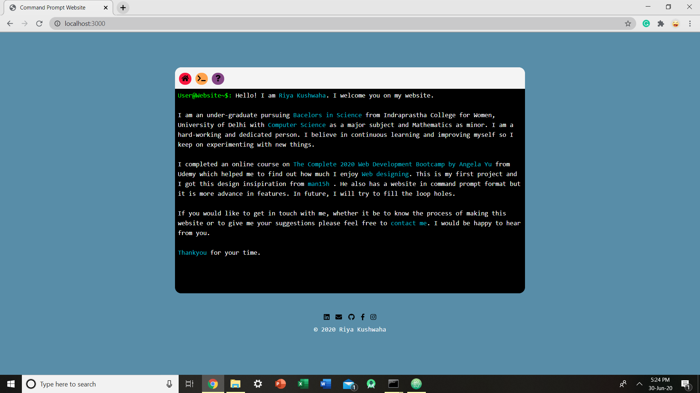

# CommandPrompt-CV

This is my first portfolio and project. It has command prompt like interface. It has three tabs, first tells about me, second is the interface to write commands and third has a picture showing the interface and feature.

## Technologies

HTML CSS, Express, Node.js

## Video 
<!-- Check out the demo video <a href="Demo/Website.mp4">here</a> -->

## Screenshots

