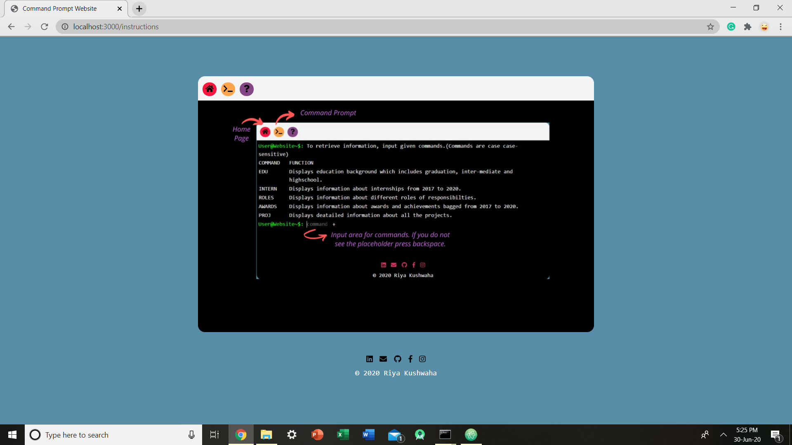

# CommandPrompt-CV

This is my first portfolio and project. It has command prompt like interface. It has three tabs, first tells about me, second is the interface to write commands and third has a picture showing the interface and feature.

## Table of contents

- [Overview](#overview)
  - [Links](#links)
  - [Screenshot](#screenshot)
- [My process](#my-process)
  - [Built with](#built-with)
- [Author](#author)

## Overview

### Links

- [Video Link](https://www.youtube.com/watch?v=xinsrTaWprs)

### Screenshot

## My process

### Built with 

- Semantic HTML5 markup
- CSS Flexbox and Grid
- Desktop-first workflow
- MongoDB
- Express
- Node.js

## Author

- LinkedIn - [Riya Kushwaha](https://www.linkedin.com/in/riyakushwaha)
- Twitter - [@riyakushwaha20](https://www.twitter.com/riyakushwaha20)
